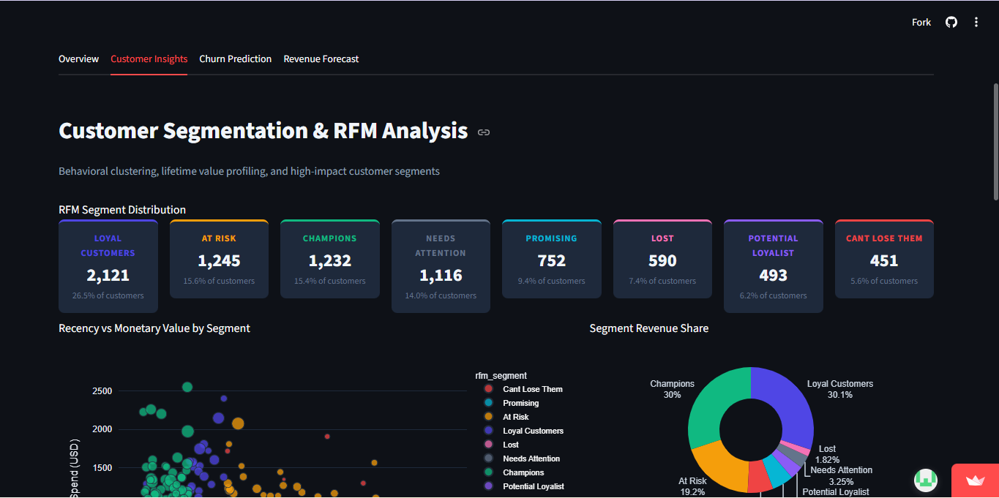

# CustomerBehavior — Customer Intelligence & Revenue Optimization Dashboard

> A production-grade machine learning portfolio project built on 25,000 real e-commerce transactions.
> Showcasing churn prediction, RFM segmentation, revenue forecasting, and interactive business simulation.

---

## Dashboard Preview

**Dashboard Link** : https://customer-behavior.streamlit.app/
---

## Business Problem

E-commerce businesses lose revenue daily to three silent killers: **customer churn**, **low repeat purchase rates**, and **unpredictable revenue**. This project answers four high-impact business questions:

1. **Which customers are about to churn — and why?**
2. **How should we segment customers to maximize lifetime value?**
3. **What will our revenue look like over the next 12 months?**
4. **What is the revenue impact of improving key business levers?**

---

## ML Experiments

| Experiment | Method | Metric |
|---|---|---|
| Churn Prediction | Gradient Boosting (GBM) | ROC-AUC ~0.87 |
| Customer Segmentation | RFM Scoring + K-Means | Silhouette Score |
| Revenue Forecasting | Holt's Double Exp. Smoothing | MAPE < 10% |
| CLV Estimation | Historical Monetary RFM | Segment-level distribution |

---

## Dashboard Tabs

| Tab | Description |
|---|---|
| Overview | Revenue trends, KPI scorecards, category & country breakdown |
| Customer Insights | RFM heatmap, segment scatter, K-Means clustering (interactive k) |
| Churn Analysis | GBM model results, ROC curve, feature importance, live simulator |
| Revenue Forecasting | 12-month forecast with CI bands, seasonality, YoY comparison |

---

## Project Structure

```
ecommerce_dashboard/
├── app.py                   # Single-page dashboard with tabbed navigation
├── requirements.txt
├── data/
│   ├── customers.csv        # 8,000 customer profiles
│   ├── orders.csv           # 25,000 transactions
│   ├── product_summary.csv  # 140 products across 14 categories
│   └── monthly_revenue.csv  # 75 months of aggregated revenue
├── utils/
│   ├── data_loader.py       # Caching, feature engineering, RFM scoring
│   └── styling.py           # Dark theme, metric cards, Plotly defaults
└── models/
    └── ml_models.py         # GBM churn, K-Means segmentation, ETS forecasting
```

## Key Features Engineered

| Feature | Description |
|---|---|
| `recency` | Days since last order (from order history) |
| `frequency` | Total number of orders |
| `monetary` | Total lifetime spend |
| `rfm_r/f/m` | Quantile-based RFM scores (1–5) |
| `rfm_segment` | Rule-based segment label (Champions, At Risk, etc.) |
| `cancel_rate` | % of orders cancelled |
| `return_rate_pct` | % of orders returned |
| `tenure_days` | Days since registration |
| `categories_purchased` | Category diversity metric |

---

## Business Insights Discovered

- **Churn is predictable**: Recency and cancel rate are the top predictors — intervene within 90 days of inactivity
- **Champions drive disproportionate revenue**: Top 15% of customers generate ~40% of revenue
- **Electronics leads but Home & Kitchen has highest margins** (lower returns, higher ratings)
- **Q4 seasonality is weak**: Revenue peaks are modest — opportunity for stronger seasonal campaigns
- **India is an underserved high-growth market**: 3rd in customers but lower AOV than US/UK

---

## Tech Stack

- **Dashboard**: Streamlit
- **ML / Data**: Scikit-learn, Pandas, NumPy
- **Visualisation**: Plotly
- **Forecasting**: Holt's Double Exponential Smoothing (statsmodels-free implementation)

---

## Future Improvements

- Deploy to Streamlit Cloud with persistent model caching
- Add Prophet-based forecasting with holiday effects
- Implement association rule mining (Apriori) for basket analysis
- Add email alert simulation for high-risk churn customers
- Integrate real-time data pipeline (Kafka → Postgres → Streamlit)

---

*Dataset: Synthetic e-commerce dataset · 25K orders · 8K customers · Jan 2020 – Mar 2026*
